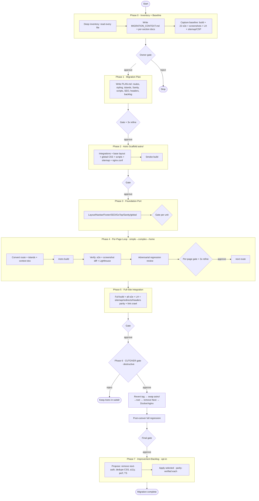

# Flow — Next.js → Astro Migration

```mermaid
flowchart TD
    S([Start]) --> P0

    subgraph P0[Phase 0 · Inventory + Baseline]
        I0[Deep inventory: read every file] --> D0[Write MIGRATION_CONTEXT.md + per-section docs]
        D0 --> B0[Capture baseline: build + 22 e2e + screenshots + LH + sitemap/CSP]
    end
    P0 --> G0{Owner gate}
    G0 -- reject --> X([Stop])
    G0 -- approve --> P1

    subgraph P1[Phase 1 · Migration Plan]
        PL[Write PLAN.md: routes, styling, islands, Sanity, scripts, SEO, headers, backlog]
    end
    P1 --> G1{Gate + 3x refine}
    G1 -- approve --> P2

    subgraph P2[Phase 2 · Astro Scaffold astro/]
        SC[Integrations + base layout + global CSS + scripts + sitemap + nginx.conf] --> SB[Smoke build]
    end
    P2 --> G2{Gate}
    G2 -- approve --> P3

    subgraph P3[Phase 3 · Foundation Port]
        F1[Layout/Navbar/Footer/SEO/GoTop/Sanity/global] --> FG{Gate per unit}
    end
    P3 --> P4

    subgraph P4[Phase 4 · Per-Page Loop · simple→complex→home]
        C[Convert route + islands + context doc] --> BB[Astro build]
        BB --> V[Verify: e2e + screenshot diff + Lighthouse]
        V --> R[Adversarial regression review]
        R --> GP{Per-page gate + 3x refine}
        GP -- approve --> NEXT[next route]
    end
    P4 --> P5

    subgraph P5[Phase 5 · Full-Site Integration]
        INT[Full build + all e2e + LH + sitemap/redirects/headers parity + link crawl]
    end
    P5 --> G5{Gate}
    G5 -- approve --> G6

    G6{Phase 6 · CUTOVER gate · destructive}
    G6 -- reject --> KEEP([Keep Astro in subdir])
    G6 -- approve --> CUT[Revert tag → swap astro/→root → remove Next → Docker/nginx]
    CUT --> FR[Post-cutover full regression] --> GF{Final gate}
    GF -- approve --> P7

    subgraph P7[Phase 7 · Improvement Backlog · opt-in]
        BL[Propose: remove next-auth, dedupe CSS, a11y, perf, TS] --> AB[Apply selected · parity-verified each]
    end
    P7 --> DONE([Migration complete])
```
